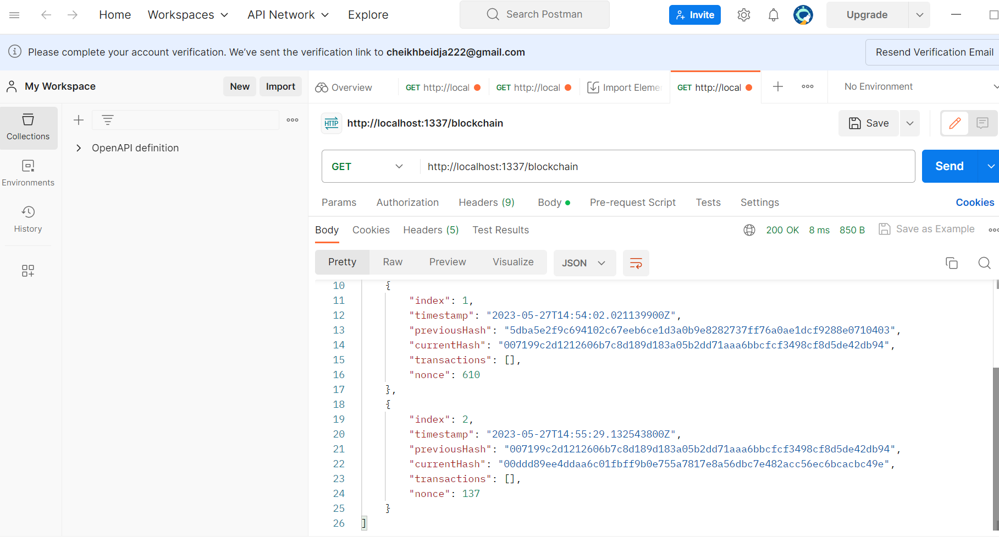
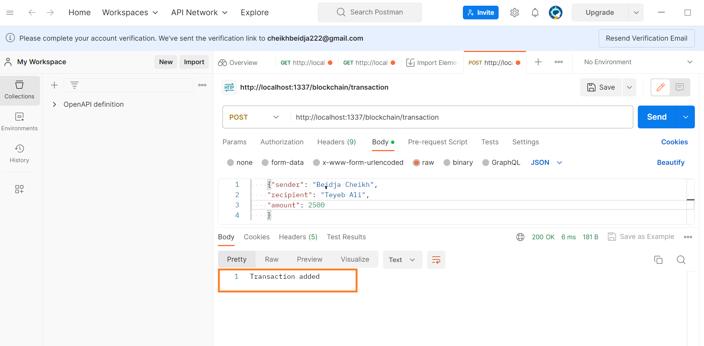

 
<h3>Deveoir : GA implementation usig MAS</h3>
<h1>compte rendu</h1> 
<h1>Beidja Cheikh </h1> 
<h2>Project Stricture</h2> 
 
### 1. Mine a new block
http://localhost:1337/blockchain/mine avec la methode  POST.
 
## 2. Get the blockchain
http://localhost:1337/blockchain avec la methode  GET.
 
 
## 3. Get Block by index
 
## 4. Add a new transaction
  { "sender": "Beidja Cheikh",
    "recipient": "Teyeb Ali",
    "amount": 2500
    }
  

